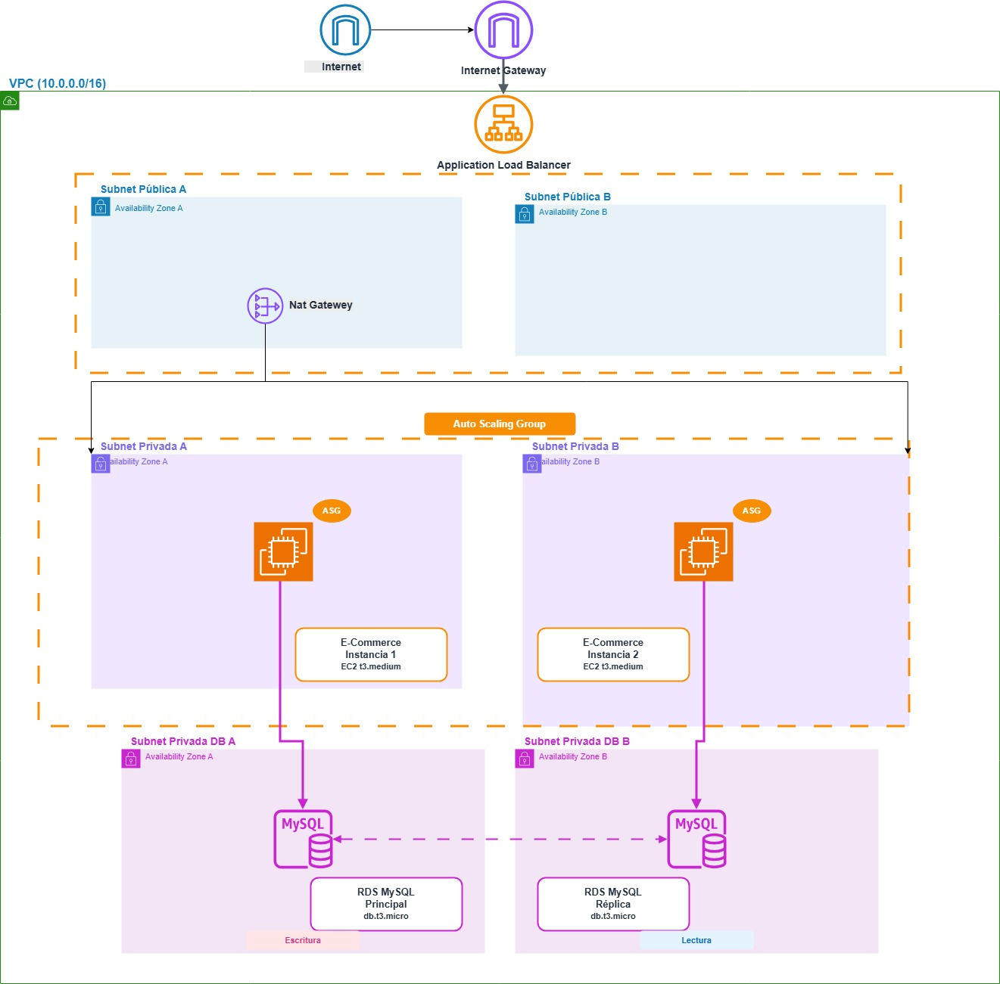

# <h1>Obligatorio - Implementación de Soluciones Cloud</h1>
## Migración del Frontend E-commerce a AWS

**Grupo:** Joaquín Escudero y Anthony Berruti

## 1. Diagrama de arquitectura

## 2. Servicios de AWS utilizados

**Networking:** VPC, Subnets (Private / Public), Internet Gateway (IGW), NAT Gateway (NGW), Route Tables.  
**Security:** Security Groups (SG).  
**Capa de aplicación:** Application Load Balancer (ALB), Auto Scaling Group (ASG), EC2 (Launch Template)
**Base de datos:** RDS (Engine MySQL)

## Datos de la infraestructura

### a. Networking
| Componente | CIDR Block |
| :--- | :--- |
| **VPC** | `10.0.0.0/16` |
| **Subredes Públicas (2)** | `10.0.1.0/24` (AZ A), `10.0.2.0/24` (AZ B) |
| **Subredes Privadas (2)** | `10.0.3.0/24` (AZ A), `10.0.4.0/24` (AZ B) |
| **Subredes RDS (2)** | `10.0.5.0/24` (AZ A), `10.0.6.0/24` (AZ B) |

### b. Servidores y Escalabilidad
| Componente | Especificación |
| :--- | :--- |
| **Tipo de Instancia** | `t3.micro` |
| **AMI ID** | Amazon Linux 2 |
| **ASG (Mínimo/Deseado/Máximo)** | `2 / 2 / 6` |
| **Política de Escalado** | Basada en CPU: Escala al 80% de CPU promedio. |

### c. Firewalling (Security Groups)
| Componente | Regla de Entrada (Ingress) |
| :--- | :--- |
| **SG del ALB** | *TCP/80* desde `0.0.0.0/0` (Internet) |
| **SG del ASG** | *TCP/80* desde el ALB |
| **SG del RDS** | *TCP/3306* desde el ASG |

## 3. Versiones utilizadas
- Terraform 1.13.3
- **RDS** MySQL 5.7.44
- **Dentro de la instancia:**
  > MySQL 5.7  
  > PHP 5.4

## 4. Instructivo de uso

### a. Requisitos previos
* **Claves de AWS:** Deben ser ingresadas en el archivo *.tfvars* previo a ejecutar el código.
* **Contraseña DB:** Se debe setear una contraseña para la base de datos dentro del archivo *.tfvars*.
* **Git Token:** Las instancias utilizan un Git Token para poder conectarse al Git donde descargaran el código de la aplicación a ejecutar. Para generarlo, se debe hacer lo siguiente:
> 1. Ingresar con su usuario a GitHub.
> 2. Dirigirse a **Opciones**.
> 3. Buscar la opción **Opciones de desarrollador [Developer settings]** en el menú de la izquierda.
> 4. Buscar la opción **Personal access tokens** > **Tokens (classic)**
> 5. Generar un token nuevo que tenga permisos de ***repo***
> 6. Copiar el token generado y pegarlo en la variable correspondiente en *.tfvars*.

### b. Despliegue de la infraestructura
1.  **Configuración:** El archivo *.tfvars* debe contener los campos mencionados en los *Requisitos previos* antes de realizar la inicialización de Terraform.
2.  **Inicialización:** `terraform init` (Descarga módulos y providers).
3.  **Validación:** `terraform validate` (Verifica la sintaxis).
4.  **Planificación:** `terraform plan` (Revisa los cambios).
5.  **Aplicación:** `terraform apply` (Despliegue).

### c. Verificación Funcional
1.  Una vez finalizado el `apply`, obtener la URL DNS del ALB (output: `alb_dns_name`).
2.  Acceder a la URL en el navegador: `http://<ALB_DNS_NAME>`.
3.  Verificar que la aplicación accede a la página y es navegable.

## 5. Aclaraciones y notas

1) En la sección donde se despliega el RDS, debido a las limitaciones de AWS Academy no pudimos elegir la que desearíamos para un despliegue real (**Multi-AZ**, esta opción desplegaría una *standby replica* en una Zona de Disponibilidad diferente, proveyendo redundancia y *failover* automático en caso de que la instancia primaria falle), asi que optamos por utilizar **Single-AZ**.

2) Durante la creación del *Launch Template*, nos encontramos con varios problemas surgidos de la explicación en torno a la instalación de **MySQL**, ya que al utilizar los comandos planteados en el *README* de la aplicación, la instalación no se llevaba a cabo como era debido, es por eso que se optó por realizar ciertos cambios y utilizar otros comandos para poder conseguir la versión de MySQL correcta para el funcionamiento de la aplicación.
